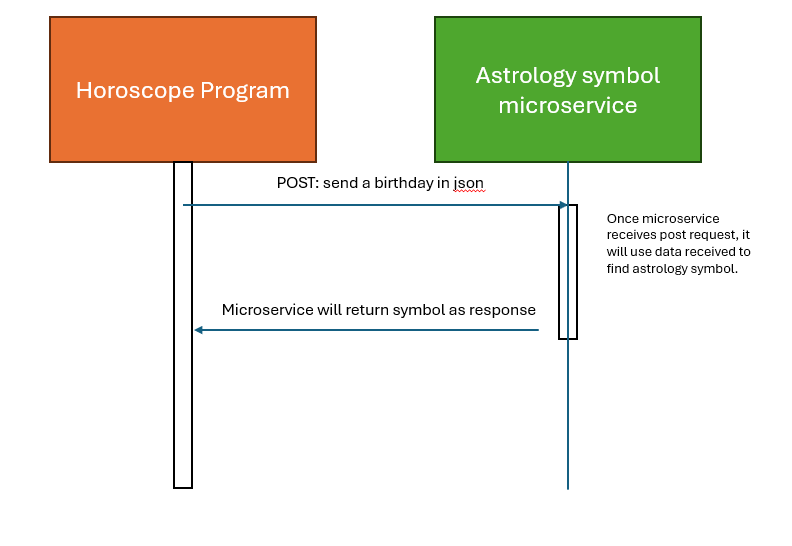

# microserviceA
# A   
Send http request to with server address 'http://example.com/exmple/route' or local host. Request will include the user inputed date a json format {'month': 1, 'day':1, 'year': 2000}  
Python Example:   
    def get_sign():  
        payload = {'month': month, 'day': day, 'year': year}  
        r = requests.post("http://127.0.0.1:5000", json=payload)  
        print(r.text)  # displays the result body. 
# B   
Flask program will respond with a json formatted response containing the zodiac sign based on the date provided.
# UML Sequence Diagram

